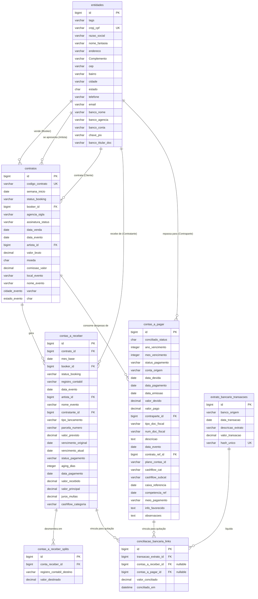

# Documento de Domínio e Especificação de Requisitos — Sistema Eventos Control

Este documento constitui a especificação de domínio e o mapeamento relacional do **Sistema Eventos Control**, estruturado a partir da análise da transcrição do brainstorming técnico e dos esquemas de dados extraídos das planilhas legadas (`contratos.xlsx`, `contas_a_receber.xlsx`, `contas_a_pagar.xlsx`, `internacional.xlsx` e `CADASTRO_OMIE.xlsx`). 

O objetivo é fornecer ao time de engenharia de software um guia técnico formal e completo para a modelagem de banco de dados e implementação dos fluxos do sistema.

---

## 1. Glossário de Domínio (Linguagem Ubíqua)

* **Gig (Apresentação):** Evento ou apresentação artística individual de um determinado artista em um local específico e em uma data determinada.
* **Contrato:** Documento jurídico que rege as condições comerciais de uma Gig (valor do cachet, comissão, data, local, contratante e obrigações adicionais).
* **Booker (Agenciador):** Colaborador interno da agência responsável por negociar a Gig, acompanhar o contrato e fazer o interfaceamento comercial.
* **Contratante:** Entidade física ou jurídica responsável por contratar a Gig e efetuar os pagamentos contratuais (cliente).
* **Contraparte:** Entidade física ou jurídica que recebe pagamentos do contas a pagar (fornecedor, artista, parceiro ou colaborador).
* **Registro Contábil (Destino Financeiro):** Conta de destino de um recebimento (ex: Panorama, Coral) ou recebimento direto pelo Artista (caracterizando fluxo interno).
* **Booking (Cachê/Cachet):** A parcela principal do valor do contrato destinada a remunerar a apresentação do artista.
* **Extra Contratual:** Lançamentos financeiros de despesas ou reembolsos ocorridos fora do escopo principal do contrato de Booking (ex: alimentação extra, logística de última hora).
* **Movimentação Interna:** Registro de fluxos financeiros que não transitam diretamente pelas contas bancárias oficiais das agências (ex: quando o contratante paga diretamente ao artista, ou quando há compensação de saldos/comissões entre eventos).
* **Conciliação Bancária:** Processo de cruzamento e baixa de lançamentos do contas a pagar/receber com as transações reais importadas do extrato bancário.
* **Remessa Direta:** Pagamento realizado diretamente em moeda estrangeira pelo contratante internacional ao artista no exterior, sem trânsito pela conta nacional da agência.
* **Split de Parcela:** Divisão de um único recebimento ou provisão entre múltiplos destinos financeiros (ex: ratear R$ 5.000,00 em 50% Panorama e 50% Artista).

---

## 2. Hierarquia de Requisitos Funcionais (RFs)

### 2.1. Módulo de Contratos (CON)
* **RF-CON-01: Cadastro de Contrato**
  * *Descrição:* Permitir o cadastro detalhado de uma Gig contratada.
  * *Regras de Negócio:*
    * Deve associar um `Booker` (colaborador), um `Artista` (entidade agenciada) e um `Contratante` (cliente).
    * Deve registrar obrigatoriamente: Código do Contrato, Data do Evento, Valor Bruto do Contrato, Moeda (BRL, USD, EUR) e a Comissão da Agência.
* **RF-CON-02: Gestão do Estado do Contrato (Máquina de Estados)**
  * *Descrição:* Controlar o ciclo de vida do contrato por meio de estados lógicos rígidos.
  * *Regras de Negócio:*
    * **Draft/Em Confecção:** Edição livre de dados. Não gera provisões financeiras ativas.
    * **Aguardando Assinatura:** Dados bloqueados para edição comercial. opcional: campo upload do documento assinado.
    * **Em Execução (Liberado):** Ativado após lançamento de valores a receber == valor do contrato. assinatura e validação do contas a receber. Libera lançamentos no contas a pagar.
    * **Concluído:** Status atribuído manualmente após *Revisão* quando todas as obrigações a receber e a pagar vinculadas à Gig forem liquidadas.
* **RF-CON-03: Filtros Avançados de Contrato**
  * *Descrição:* Permitir a pesquisa detalhada de contratos na base histórica.
  * *Regras de Negócio:*
    * Filtros por: Período (Data de início e fim da semana da Gig), Status do Contrato, Status de Assinatura, Artista e Booker.

### 2.2. Módulo de Contas a Receber (REC)
* **RF-REC-01: Provisionamento de Recebíveis**
  * *Descrição:* Lançamento das parcelas e valores extras associados a um contrato.
  * *Regras de Negócio:*
    * **Se** o lançamento for do tipo *Booking*, **então** a soma das parcelas deve coincidir exatamente com o valor bruto contratado para que o contrato saia do estado de provisionamento.
    * **Se** o lançamento for do tipo *Extra Contratual* (ex: Alimentação), **então** o valor não deve entrar no cálculo da validação do valor base do contrato.
* **RF-REC-02: Roteamento de Recebimentos e Splits**
  * *Descrição:* Definir o destino contábil de cada recebimento.
  * *Regras de Negócio:*
    * O operador deve selecionar o destino (`Registro Contábil`): Panorama, Coral ou Artista (Movimentação Interna).
    * Permitir a divisão (*split*) de uma mesma parcela para mais de um destino contábil, gerando registros de transações filhas com valores proporcionais.
* **RF-REC-03: Controle de Inadimplência e Aging**
  * *Descrição:* Calcular e expor na interface o status de vencimento de cada título.
  * *Regras de Negócio:*
    * **Se** a data atual for posterior à `Data de Vencimento Atual` e o status for `em aberto`, **então** calcular a quantidade de dias de atraso (`Aging`) e destacar em cor vermelha.
    * **Se** a parcela estiver quitada, **então** exibir badge de status `Pago` em verde com a respectiva `Data de Pagamento`.
* **RF-REC-04: Ajuste de Saldos por Movimentação Interna**
  * *Descrição:* Registrar comissões pendentes quando o artista recebe 100% do valor do show direto do contratante.
  * *Regras de Negócio:*
    * **Se** o recebimento for direto pelo artista, **então** o sistema deve gerar automaticamente um saldo devedor (débito) do artista para com a agência no valor equivalente à comissão cadastrada no contrato, registrando em conta de tesouraria de *Movimentação Interna*.

### 2.3. Módulo de Contas a Pagar (PAG)
* **RF-PAG-01: Bloqueio de Lançamentos de Gig**
  * *Descrição:* Impedir o cadastro de pagamentos de despesas de uma apresentação sem provisionamento do receber.
  * *Regras de Negócio:*
    * **Se** o contrato de referência não estiver com o provisionamento concluído e liberado pelo setor de contas a receber, **então** o botão de novo lançamento de contas a pagar para aquele contrato deve permanecer desabilitado.
* **RF-PAG-02: Classificação de Despesas (Contratuais vs. Administrativas)**
  * *Descrição:* Segregar despesas atreladas a eventos de despesas fixas da agência.
  * *Regras de Negócio:*
    * **Se** a despesa for classificada como *Administrativa* (ex: Folha de Pagamento, Aluguel), **então** o sistema deve ocultar/desobrigar o preenchimento dos campos `Contrato Referência`, `Artista` e `Data do Evento`.
* **RF-PAG-03: Rateio de Cachê (Múltiplas Contrapartes)**
  * *Descrição:* Permitir pagar o cachê de uma Gig para diferentes favorecidos.
  * *Regras de Negócio:*
    * O sistema deve permitir o lançamento de múltiplos registros de contas a pagar para o mesmo `Contrato Referência`, distribuindo as frações do cachê para diferentes `Contrapartes` (CNPJ/CPF) cadastrados.
* **RF-PAG-04: Fluxo de Execução Financeira (Status de Pagamento)**
  * *Descrição:* Controle de liberação de pagamentos pelo administrador financeiro.
  * *Regras de Negócio:*
    * Os lançamentos de pagamento iniciam como `Pendente`.
    * O gestor pode marcar o lançamento como `Processando` (enviado para lote do banco).
    * Após confirmação do débito em conta, o status é atualizado para `Pago` e integrado à fila de conciliação bancária.

### 2.4. Módulo de Conciliação Bancária (CONC)
* **RF-CONC-01: Importação de Extrato Bancário**
  * *Descrição:* Carregamento de arquivos de extrato para conciliação.
  * *Regras de Negócio:*
    * O sistema deve validar e impedir a importação de transações bancárias duplicadas (cruzando hash da transação, data, banco e valor).
* **RF-CONC-02: Busca e Correspondência Dinâmica (Auto-match)**
  * *Descrição:* Sugerir correspondências para transações do extrato.
  * *Regras de Negócio:*
    * O sistema deve realizar busca textual dinâmica (fuzzy search) nas observações, descrições, nome de artistas e eventos para tentar correlacionar o registro do extrato com uma provisão em aberto no sistema.
* **RF-CONC-03: Conciliação Multilateral (Múltiplos Títulos)**
  * *Descrição:* Permitir que uma única transação bancária liquide vários títulos provisionados ou vice-versa.
  * *Regras de Negócio:*
    * O sistema deve permitir selecionar N lançamentos de provisão para liquidar 1 transação de extrato.
    * **Se** a soma dos valores dos títulos selecionados diferir do valor líquido da transação do extrato, **então** o sistema deve impedir a conclusão da conciliação.
* **RF-CONC-04: Ajuste Rápido de Divergência**
  * *Descrição:* Corrigir valores de provisão diretamente na tela de conciliação.
  * *Regras de Negócio:*
    * Permitir a edição do valor de uma provisão selecionada diretamente na interface de conciliação para igualá-la ao valor real recebido/pago no extrato (registrando a diferença em logs de auditoria).

### 2.5. Módulo de Câmbio e Fluxo Internacional (INT)
* **RF-INT-01: Classificação de Fluxo Internacional**
  * *Descrição:* Identificar a modalidade da operação internacional.
  * *Regras de Negócio:*
    * **Se** for uma *Importação*, **então** representa um artista estrangeiro se apresentando no Brasil.
    * **Se** for uma *Exportação*, **então** representa um artista nacional se apresentando no exterior.
* **RF-INT-02: Registro de Valores Multimoedas**
  * *Descrição:* Permitir lançamentos em BRL, USD, GBP e EUR de forma segregada.
  * *Regras de Negócio:*
    * **Se** houver valor preenchido apenas nas colunas USD, GBP ou EUR sem correspondente em BRL, **então** o status do lançamento deve ser marcado como `Aguardando Fechamento de Câmbio`.
    * **Se** o valor inserido for negativo, **então** o sistema deve tratá-lo como débito contábil (valor devido) mantendo seu valor absoluto negativo.
* **RF-INT-03: Remessa Direta via Movimentação Interna**
  * *Descrição:* Contabilizar fluxos internacionais diretos entre contratante e artista.
  * *Regras de Negócio:*
    * Lançamentos internacionais onde o dinheiro não transita pela conta bancária nacional da agência devem ser direcionados para a conta contábil de *Movimentação Interna*, bypassando a etapa de conciliação bancária de extrato oficial.

### 2.6. Cadastro Unificado de Entidades (ENT)
* **RF-ENT-01: Cadastro Único com Tags**
  * *Descrição:* Centralizar clientes/fornecedores, artistas e colaboradores.
  * *Regras de Negócio:*
    * Impedir a duplicidade de cadastros por meio da validação única de CNPJ/CPF.
    * Classificar o papel da entidade no sistema por meio de etiquetas dinâmicas (`Tags`), sendo permitida a atribuição de múltiplas tags a uma mesma pessoa (ex: um registro com tag `Fornecedor` e `Artista`).

---

## 3. Hierarquia de Requisitos Não Funcionais (RNFs)

### 3.1. Segurança (RNF-SEG)
* **RNF-SEG-01: Controle de Acesso Baseado em Perfis (RBAC)**
  * *Descrição:* Garantir que cada usuário acesse apenas os módulos autorizados para seu escopo.
  * *Métrica:* O sistema deve rejeitar requisições de API para lançamentos administrativos ou de recursos humanos se o usuário não possuir a permissão `role_admin_finance`.
* **RNF-SEG-02: Criptografia de Dados Bancários**
  * *Descrição:* Proteger os dados bancários e chaves PIX de favorecidos no banco de dados.
  * *Métrica:* Os campos de dados bancários (agência, conta corrente e PIX) devem ser armazenados criptografados em repouso (AES-256).

### 3.2. Usability / Usabilidade (RNF-USA)
* **RNF-USA-01: Interface de Lançamento Compacta**
  * *Descrição:* Otimizar o tempo de preenchimento dos operadores reduzindo a necessidade de rolagem de tela.
  * *Métrica:* O formulário de lançamento de Contas a Pagar deve ser dividido em um assistente (*wizard*) de no máximo 3 passos (1. Dados Gerais, 2. Dados Bancários, 3. Periodicidade), ocupando 100% da área visível (*above the fold*).
* **RNF-USA-02: Semântica de Cores para Aging**
  * *Descrição:* Apresentar de forma visual e intuitiva o status financeiro dos títulos.
  * *Métrica:* Títulos atrasados há mais de 1 dia devem possuir destaque vermelho (#DC3545), títulos a vencer em até 3 dias destaque amarelo/laranja (#FFC107) e títulos conciliados/pagos destaque verde (#28A745).

### 3.3. Confiabilidade e Consistência (RNF-REL)
* **RNF-REL-01: Integridade da Máquina de Estados**
  * *Descrição:* Garantir a consistência dos dados financeiros do contrato.
  * *Métrica:* O banco de dados deve utilizar transações ACID para garantir que a liberação do contas a pagar ocorra exatamente no mesmo instante em que a validação de soma das parcelas do receber for concluída com sucesso.

### 3.4. Performance / Desempenho (RNF-PER)
* **RNF-PER-01: Tempo de Resposta da Busca de Conciliação**
  * *Descrição:* Rapidez na pesquisa de provisões na Central de Conciliação.
  * *Métrica:* A consulta de termos indexados (fuzzy search) na tela de conciliação não deve exceder 500ms para uma base de dados contendo até 100.000 lançamentos.

---

## 4. Mapeamento de Tabelas de Banco de Dados e Dicionário de Dados

A seguir, apresenta-se o mapeamento das planilhas Excel para tabelas relacionais normalizadas.

### 4.1. Tabela: `entidades`
* **Origem Legada:** `CADASTRO_OMIE.xlsx` (Sheet: `Clientes e Fornecedores`)
* **Propósito:** Cadastro unificado de pessoas físicas e jurídicas.

| Coluna Banco de Dados | Tipo de Dados SQL | Restrições / Chaves | Descrição / Mapeamento Excel |
| :--- | :--- | :--- | :--- |
| `id` | `BIGINT` | `PRIMARY KEY`, `AUTO_INCREMENT` | Identificador único da entidade. |
| `tags` | `VARCHAR(255)` | `NOT NULL` | Perfis da entidade (ex: "Cliente", "Artista", "Fornecedor", "Colaborador"). Mapeia `Tags`. |
| `cnpj_cpf` | `VARCHAR(20)` | `UNIQUE`, `NOT NULL` | Documento único de identificação. Mapeia `CNPJ/CPF`. |
| `razao_social` | `VARCHAR(255)` | `NOT NULL` | Nome legal. Mapeia `Razão Social`. |
| `nome_fantasia` | `VARCHAR(255)` | `NULL` | Nome comercial. Mapeia `Nome Fantasia`. |
| `endereco` | `VARCHAR(255)` | `NULL` | Logradouro e número. Mapeia `Endereço`. |
| `complemento` | `VARCHAR(100)` | `NULL` | Complemento do endereço. Mapeia `Complemento`. |
| `cep` | `VARCHAR(10)` | `NULL` | CEP formatado. Mapeia `CEP`. |
| `bairro` | `VARCHAR(100)` | `NULL` | Bairro. Mapeia `Bairro`. |
| `cidade` | `VARCHAR(100)` | `NULL` | Cidade. Mapeia `Cidade`. |
| `estado` | `CHAR(2)` | `NULL` | Sigla do estado. Mapeia `Estado`. |
| `telefone` | `VARCHAR(50)` | `NULL` | Telefone de contato. Mapeia `Telefone`. |
| `email` | `VARCHAR(100)` | `NULL` | E-mail principal de contato. Mapeia `E-mail`. |
| `website` | `VARCHAR(100)` | `NULL` | WebSite. Mapeia `WebSite`. |
| `inscricao_estadual`| `VARCHAR(50)` | `NULL` | Inscrição Estadual. Mapeia `Inscrição Estadual`. |
| `banco_nome` | `VARCHAR(100)` | `NULL` | Nome do banco do favorecido. Mapeia `Banco (Dados Bancários)`. |
| `banco_agencia` | `VARCHAR(20)` | `NULL` | Número da agência bancária. Mapeia `Agência (Dados Bancários)`. |
| `banco_conta` | `VARCHAR(50)` | `NULL` | Número da conta corrente. Mapeia `Conta Corrente (Dados Bancários)`. |
| `chave_pix` | `VARCHAR(100)` | `NULL` | Chave Pix do favorecido. Mapeia `Chave PIX`. |
| `banco_titular_doc` | `VARCHAR(20)` | `NULL` | CNPJ/CPF do titular da conta. Mapeia `CNPJ ou CPF do Titular (Dados Bancários)`. |

---

### 4.2. Tabela: `contratos`
* **Origem Legada:** `contratos.xlsx` (Sheets: `dashboard 2026`, `dashboard`)
* **Propósito:** Registro comercial das Gigs contratadas.

| Coluna Banco de Dados | Tipo de Dados SQL | Restrições / Chaves | Descrição / Mapeamento Excel |
| :--- | :--- | :--- | :--- |
| `id` | `BIGINT` | `PRIMARY KEY`, `AUTO_INCREMENT` | Identificador único do contrato. |
| `codigo_contrato` | `VARCHAR(50)` | `UNIQUE`, `NOT NULL` | Número ou código de referência. Mapeia `CONTRATO`. |
| `semana_inicio` | `DATE` | `NOT NULL` | Segunda-feira de início da semana da gig. Mapeia `SEMANA`. |
| `status_booking` | `VARCHAR(50)` | `NOT NULL` | Status da gig (ex: Confirmado, Cancelado). Mapeia `STATUS`. |
| `booker_id` | `BIGINT` | `FOREIGN KEY` references `entidades(id)` | Vínculo com a entidade que vendeu. Mapeia `BOOKER` (Nome). |
| `agencia_sigla` | `VARCHAR(20)` | `NOT NULL` | Sigla da agência responsável (PAN, Coral, MZK). Mapeia `AGE`. |
| `assinatura_status` | `VARCHAR(50)` | `NOT NULL` | Status do trâmite de assinatura. Mapeia `ASSIN`. |
| `data_venda` | `DATE` | `NULL` | Data de fechamento comercial. Mapeia `VENDA`. |
| `data_evento` | `DATE` | `NOT NULL` | Data real em que o artista se apresenta. Mapeia `DATA`. |
| `artista_id` | `BIGINT` | `FOREIGN KEY` references `entidades(id)` | Artista contratado. Mapeia `ARTISTA` (Nome). |
| `valor_bruto` | `DECIMAL(15,2)` | `NOT NULL` | Valor bruto acordado. Mapeia `VALOR`. |
| `moeda` | `CHAR(3)` | `DEFAULT 'BRL'` | Moeda do contrato (BRL, USD, EUR). Mapeia `MOEDA`. |
| `comissao_valor` | `DECIMAL(15,2)` | `NULL` | Valor nominal da comissão da agência. Mapeia `COMISSÃO`. |
| `local_evento` | `VARCHAR(255)` | `NULL` | Nome do estabelecimento/palco. Mapeia `LOCAL`. |
| `nome_evento` | `VARCHAR(255)` | `NOT NULL` | Nome fantasia da festa ou festival. Mapeia `EVENTO`. |
| `cidade_evento` | `VARCHAR(100)` | `NULL` | Cidade do evento. Mapeia `CIDADE`. |
| `estado_evento` | `CHAR(2)` | `NULL` | Estado da federação. Mapeia `ESTADO`. |
| `regiao_evento` | `VARCHAR(50)` | `NULL` | Região geográfica (Sudeste, Nordeste etc.). Mapeia `REGIÃO`. |
| `pais_evento` | `VARCHAR(100)` | `DEFAULT 'Brasil'` | País de realização. Mapeia `PAÍS`. |

---

### 4.3. Tabela: `contas_a_receber`
* **Origem Legada:** `contas_a_receber.xlsx` (Sheet: `PAN`)
* **Propósito:** Controle de faturamento, recebíveis de Booking e extras.

| Coluna Banco de Dados | Tipo de Dados SQL | Restrições / Chaves | Descrição / Mapeamento Excel |
| :--- | :--- | :--- | :--- |
| `id` | `BIGINT` | `PRIMARY KEY`, `AUTO_INCREMENT` | Identificador único do recebível. |
| `contrato_id` | `BIGINT` | `FOREIGN KEY` references `contratos(id)`, `NULL` | Contrato de referência da Gig. Mapeado via metadados de evento. |
| `mes_base` | `DATE` | `NOT NULL` | Mês base contábil. Mapeia `Mês base`. |
| `booker_id` | `BIGINT` | `FOREIGN KEY` references `entidades(id)` | Booker responsável. Mapeia `Booker`. |
| `status_booking` | `VARCHAR(50)` | `NOT NULL` | Status da gig. Mapeia `Status Booking`. |
| `registro_contabil` | `VARCHAR(100)` | `NOT NULL` | Destino financeiro (Panorama Music, Coral, Artista). Mapeia `Registro Contábil`. |
| `data_evento` | `DATE` | `NOT NULL` | Data do evento. Mapeia `Data do Evento`. |
| `artista_id` | `BIGINT` | `FOREIGN KEY` references `entidades(id)` | Artista do show. Mapeia `Artista`. |
| `nome_evento` | `VARCHAR(255)` | `NOT NULL` | Nome do evento. Mapeia `Evento`. |
| `contratante_id` | `BIGINT` | `FOREIGN KEY` references `entidades(id)` | Cliente pagador. Mapeia `Contratante` / `Cnpj/Cpf`. |
| `tipo_lancamento` | `VARCHAR(50)` | `NOT NULL` | Categoria de entrada (Booking, Alimentação, Extra). Mapeia `Tipo`. |
| `parcela_numero` | `VARCHAR(10)` | `NOT NULL` | Indicador de parcelamento (ex: "1/2"). Mapeia `Parcela`. |
| `valor_previsto` | `DECIMAL(15,2)` | `NOT NULL` | Valor nominal provisionado. Mapeia `Valor`. |
| `vencimento_original`| `DATE` | `NOT NULL` | Data original combinada. Mapeia `Venc. original`. |
| `vencimento_atual` | `DATE` | `NOT NULL` | Data prorrogada ou renegociada. Mapeia `Venc. atual`. |
| `status_pagamento` | `VARCHAR(50)` | `DEFAULT 'aberto'` | Status da quitação (pago, em aberto). Mapeia `Status Pagto`. |
| `aging_dias` | `INTEGER` | `DEFAULT 0` | Dias em atraso ou remanescentes. Mapeia `Aging`. |
| `data_pagamento` | `DATE` | `NULL` | Data de quitação bancária. Mapeia `Data Pagto`. |
| `valor_recebido` | `DECIMAL(15,2)` | `DEFAULT 0.00` | Valor real que deu entrada na conta. Mapeia `Valor recebido`. |
| `valor_principal` | `DECIMAL(15,2)` | `DEFAULT 0.00` | Valor amortizado da dívida principal. Mapeia `Valor principal`. |
| `juros_multas` | `DECIMAL(15,2)` | `DEFAULT 0.00` | Valores adicionais recebidos. Mapeia `Juros/Multas`. |
| `cashflow_categoria`| `VARCHAR(100)` | `NULL` | Classificação do fluxo de caixa. Mapeia `Cashflow`. |

---

### 4.4. Tabela: `contas_a_pagar`
* **Origem Legada:** `contas_a_pagar.xlsx` (Sheet: `Aging List`)
* **Propósito:** Controle de despesas e repasses financeiros.

| Coluna Banco de Dados | Tipo de Dados SQL | Restrições / Chaves | Descrição / Mapeamento Excel |
| :--- | :--- | :--- | :--- |
| `id` | `BIGINT` | `PRIMARY KEY`, `AUTO_INCREMENT` | Identificador único da despesa. |
| `conciliado_status` | `CHAR(1)` | `NULL` | Identificador de conciliação bancária ("R" = Conciliado). Mapeia `Conc.`. |
| `ano_vencimento` | `INTEGER` | `NOT NULL` | Ano de competência de pagamento. Mapeia `Ano`. |
| `mes_vencimento` | `INTEGER` | `NOT NULL` | Mês de competência de pagamento. Mapeia `Mês`. |
| `status_pagamento` | `VARCHAR(50)` | `DEFAULT 'pendente'` | Estado do pagamento (paid, unpaid, etc.). Mapeia `Status`. |
| `conta_origem` | `VARCHAR(100)` | `NOT NULL` | Conta de saída dos fundos. Mapeia `Conta` (Unnamed: 4). |
| `data_devida` | `DATE` | `NOT NULL` | Data programada para o vencimento. Mapeia `Data devida`. |
| `data_pagamento` | `DATE` | `NULL` | Data real de execução do débito. Mapeia `Data Pagto`. |
| `data_emissao` | `DATE` | `NULL` | Data de emissão do documento/fatura. Mapeia `Emissão`. |
| `valor_devido` | `DECIMAL(15,2)` | `NOT NULL` | Valor nominal da despesa (positivo em DB). Mapeia `Valor devido`. |
| `valor_pago` | `DECIMAL(15,2)` | `DEFAULT 0.00` | Valor real pago (positivo em DB). Mapeia `Valor pago`. |
| `contraparte_id` | `BIGINT` | `FOREIGN KEY` references `entidades(id)` | Favorecido do pagamento. Mapeia `Contra-parte` / `Cnpj / Cpf`. |
| `tipo_doc_fiscal` | `VARCHAR(100)` | `NULL` | Tipo do documento (Boleto, Contrato, etc.). Mapeia `Tipo doc. Fiscal`. |
| `num_doc_fiscal` | `VARCHAR(100)` | `NULL` | Número de identificação fiscal. Mapeia `# doc. Fiscal`. |
| `descricao` | `TEXT` | `NULL` | Descrição minuciosa da despesa. Mapeia `Descrição`. |
| `data_evento` | `DATE` | `NULL` | Data da Gig de referência. Mapeia `Data Evento`. |
| `contrato_ref_id` | `BIGINT` | `FOREIGN KEY` references `contratos(id)`, `NULL` | Vínculo com a Gig de referência. Mapeia `Ctr Ref.`. |
| `plano_contas_id` | `VARCHAR(100)` | `NOT NULL` | Classificação contábil do item. Mapeia `Conta` (Unnamed: 17). |
| `cashflow_cat` | `VARCHAR(100)` | `NULL` | Categoria primária de Cashflow. Mapeia `Cashflow`. |
| `cashflow_subcat` | `VARCHAR(100)` | `NULL` | Subcategoria secundária de Cashflow. Mapeia `Cashflow2`. |
| `caixa_referencia` | `DATE` | `NULL` | Data base caixa. Mapeia `Caixa`. |
| `competencia_ref` | `DATE` | `NULL` | Data base competência. Mapeia `Competência`. |
| `meio_pagamento` | `VARCHAR(50)` | `NULL` | Canal de pagamento (Pix, TED, etc.). Mapeia `Meio de Pagto`. |
| `info_favorecido` | `TEXT` | `NULL` | Dados bancários pontuais do lançamento. Mapeia `Info Favorecido`. |
| `observacoes` | `TEXT` | `NULL` | Informações gerais adicionais. Mapeia `Obs`. |

---

### 4.5. Tabelas Auxiliares de Configuração (Tabelas de Domínio)

#### Tabela: `nomenclaturas_config`
* **Origem Legada:** `contas_a_pagar.xlsx` (Sheet: `Nomenclaturas`)
* **Propósito:** Armazenar os domínios de valores padrão de despesas e classificações contábeis aceitas no sistema.

| Coluna | Tipo | Restrições | Descrição |
| :--- | :--- | :--- | :--- |
| `id` | `INTEGER` | `PRIMARY KEY`, `AUTO_INCREMENT` | Identificador único da nomenclatura. |
| `tipo_documento` | `VARCHAR(100)` | `NULL` | Tipo de documento fiscal permitido. |
| `conta_contabil` | `VARCHAR(100)` | `NULL` | Nome da conta contábil padronizada (Cost Center). |
| `categoria_cashflow`| `VARCHAR(100)` | `NULL` | Linha padrão de Cashflow associada. |

---

## 5. Diagrama de Relacionamento de Entidades (ERD)

Abaixo é apresentado o diagrama técnico ilustrando as chaves primárias, estrangeiras e a cardinalidade dos relacionamentos lógicos do sistema:

