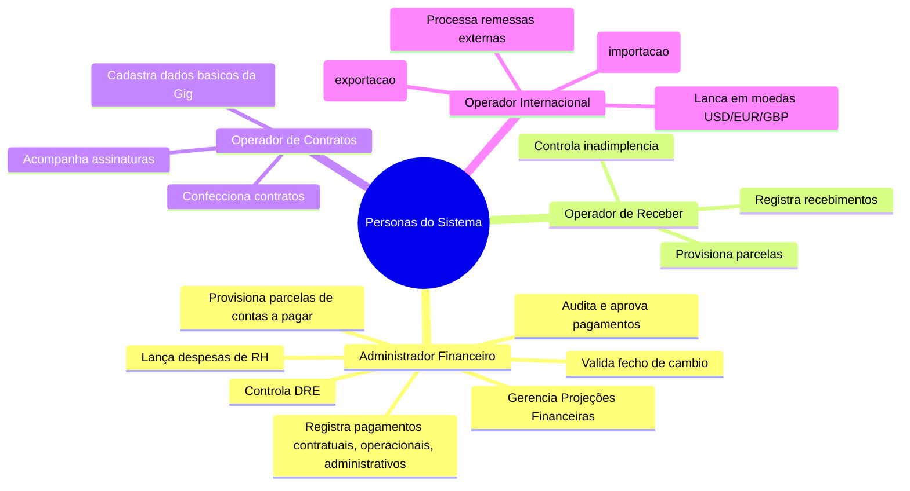
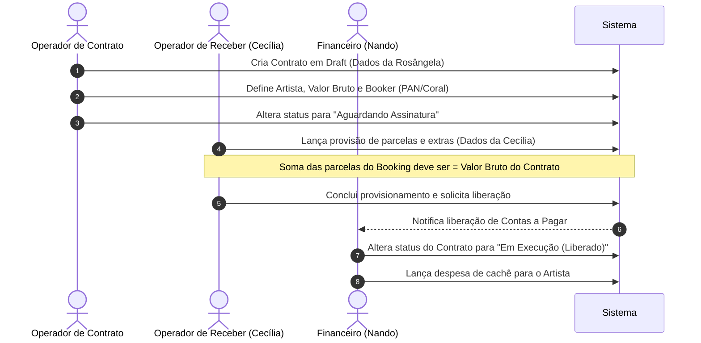
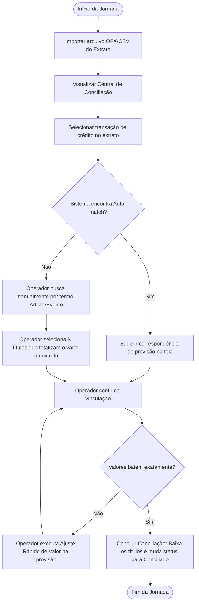
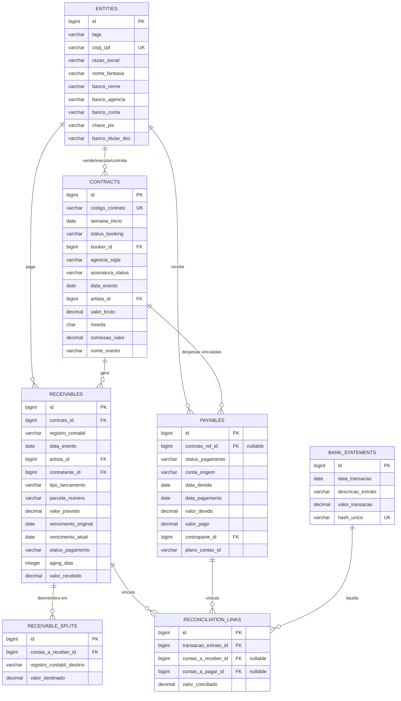

# Documento de Requisitos do Produto (PRD) — Sistema Eventos Control

Este **Product Requirements Document (PRD)** define os requisitos funcionais, não funcionais, escopo e regras de negócio para a construção do **Sistema Eventos Control**. Este documento consolida a transição do fluxo legado baseado em planilhas Excel (`contratos.xlsx`, `contas_a_receber.xlsx`, `contas_a_pagar.xlsx`, `internacionais.xlsx`, `CADASTRO_OMIE.xlsx`) para uma plataforma web centralizada de gestão financeira e operacional.

---

## 1. Visão Geral do Produto

### 1.1. Problema de Negócio
Atualmente, as operações comerciais e financeiras da agência (Gigs nacionais e internacionais) são geridas de forma descentralizada em múltiplas planilhas do Microsoft Excel. Esta descentralização gera os seguintes problemas:
* **Falta de integridade dos dados:** Risco de repasse de cachês em duplicidade (ex: pagar o artista que já recebeu diretamente do contratante).
* **Processos manuais e lentos:** A conciliação bancária exige o cruzamento visual entre planilhas financeiras e extratos bancários, consumindo dias de trabalho operacional.
* **Complexidade no fluxo internacional:** O acompanhamento de taxas de câmbio, remessas diretas ao exterior e conversões de moedas (BRL, USD, EUR) é passível de falhas manuais e inconsistências tributárias.
* **Privacidade limitada:** Ausência de controle de acessos (RBAC), permitindo que operadores de Gigs visualizem saldos administrativos confidenciais (ex: folha de pagamento da agência).

### 1.2. Objetivos do Produto
* **Unificar as bases de dados:** Migrar as planilhas Excel para um banco de dados relacional estruturado, eliminando redundâncias e inconsistências.
* **Garantir consistência financeira:** Bloquear o fluxo de contas a pagar de um contrato até que o provisionamento de contas a receber seja concluído e validado.
* **Automatizar a conciliação bancária:** Desenvolver uma central de conciliação que suporte buscas dinâmicas, sugestões inteligentes de correspondência (*auto-match*) e conciliações de múltiplos lançamentos para uma única transação bancária.
* **Proteger dados confidenciais:** Estabelecer controle de acesso baseado em perfis (RBAC), ocultando dados de folha de pagamento e administrativos para usuários sem privilégios de Administrador Financeiro.

### 1.3. Público-Alvo e Personas

* **Super Admin:** Perfil master. controle total e irrestrito a todas as funcinalidades do sistema. único qque tem acesso ao portal "operacional".
* **Administrador Financeiro (ex: Nando):** Responsável por conciliar transações complexas, fechar câmbio internacional, gerenciar contas corporativas e despesas de RH/Administrativo.
* **Operador de Contas a Receber (ex: Cecília):** Responsável por lançar provisões de recebimento, registrar baixas (recebimentos), monitorar inadimplência e emitir dados de cobrança.
* **Operador de Contratos:** Focado em cadastrar novos contratos de Gigs, monitorar status de assinatura e preencher dados básicos de eventos.
* **Operador do Setor Internacional (ex: Carol/Vitor):** Responsável pelo acompanhamento de shows de gringos no Brasil (Importações) e artistas nacionais no exterior (Exportações), lançamentos multimoedas e remessas diretas.

### 1.4. Proposta de Valor Única
Centralizar a vida operacional e financeira da agência em um sistema integrado, garantindo que nenhum repasse a pagar seja executado sem o devido provisionamento e liquidação do a receber correspondente, reduzindo em até 90% o tempo operacional de conciliação bancária e auditoria.

---

## 2. Escopo do Projeto

### 2.1. In-Scope (MVP / Versão Inicial)
* Cadastro unificado de entidades (Clientes/Fornecedores, Artistas, Colaboradores) com base na estrutura de dados do Omie.
* Gestão do ciclo de vida de contratos e apresentações (Gigs).
* Módulo de Contas a Receber com suporte a parcelamento, extras e splits de destinos financeiros (Panorama, Coral, Artista).
* Validação automática de equivalência de provisão a receber para liberação do Contas a Pagar correspondente.
* Módulo de Contas a Pagar operacional e administrativo.
* Central de Conciliação Bancária com importação de extratos OFX, auto-match e conciliações N-para-1.
* Fluxo Internacional (Import/Export) básico com suporte a três moedas (BRL, USD, EUR) e controle de fechamento de câmbio.
* Sistema de controle de acesso (RBAC) com segregação de dados corporativos de RH.

### 2.2. Out-of-Scope (Fases Futuras / Roadmap) -> Isso não será implementado agora
* Integração em tempo real (Open Finance) via APIs bancárias para busca automática de extratos e execução de transferências (Pix/TED) de forma automática.
* Emissão automatizada de Notas Fiscais integrada a sistemas de prefeituras.
* Assinatura eletrônica de contratos integrada nativamente dentro do sistema (ex: DocuSign/Clicksign integrada via API, no MVP o status é alterado manualmente pelo operador de contratos).
* Conciliação 100% autônoma baseada em Inteligência Artificial sem revisão humana (no MVP, o auto-match é sugerido, mas a baixa exige confirmação do operador).

### 2.3. Dependências Externas Críticas
* Importação e compatibilidade de arquivos de extrato gerados por bancos (extratos padrão OFX do Bradesco/Itaú).
* Sincronização dos cadastros legados de pessoas do ERP Omie (`CADASTRO_OMIE.xlsx`).

---

## 3. Requisitos Funcionais (RFs) - Priorização MoSCoW

### 3.1. Requisitos de Contratos & Entidades (Must Have - P0)

#### RF-001: Cadastro Único de Entidades com Tags
* **Descrição:** O sistema deve manter uma base unificada de pessoas físicas e jurídicas, unificando clientes/fornecedores, artistas e colaboradores(efetivo interno).
* **Critérios de Aceitação:**
  * O cadastro deve ser indexado unicamente por CNPJ ou CPF (impedindo duplicidade).
  * Cada entidade pode receber uma ou mais etiquetas/tags (`Artista`, `Colaborador`, `Cliente`, `Fornecedor`).
  * Mapear todos os campos bancários contidos no arquivo `CADASTRO_OMIE.xlsx` (banco, agência, conta, chave PIX e titularidade).

#### RF-002: Ciclo de Vida do Contrato (Máquina de Estados)
* **Descrição:** Gerenciar a transição de estados de um contrato e seus impactos operacionais.
* **Critérios de Aceitação:**
  * Estados válidos: `Draft`, `Aguardando Assinatura`, `Em Execução` (Liberado), `Concluído`.
  * **Se** o contrato estiver em `Draft` ou `Aguardando Assinatura`, **então** os módulos de contas a pagar e conciliação bancária devem estar bloqueados para ele.
  * O estado `Concluído` deve ser atingido de forma automatizada apenas quando o saldo a receber e a pagar vinculados ao contrato estiverem totalmente liquidados e conciliados (saldo restante = R$ 0,00).

---

### 3.2. Requisitos de Contas a Receber (Must Have - P0)

#### RF-003: Provisionamento e Validação de Recebíveis
* **Descrição:** Lançar e validar parcelas de recebimento baseadas no contrato.
* **Critérios de Aceitação:**
  * Diferenciar lançamentos de `Booking` (valor do contrato) e despesas `Extra Contratuais` (alimentação, passagens).
  * **Se** a soma dos lançamentos do tipo `Booking` for diferente do valor total bruto cadastrado no contrato, **então** o sistema deve exibir alerta de "Provisionamento Incompleto" e impedir a transição do contrato para o status `Em Execução`.
  * Lançamentos do tipo `Extra Contratual` não devem influenciar na validação do valor base do contrato.

#### RF-004: Splits de Destino de Recebíveis
* **Descrição:** Direcionamento de frações de parcelas a receber para destinos diferentes.
* **Critérios de Aceitação:**
  * Permitir que uma parcela (ex: Parcela 1/2) seja desmembrada em frações com destinos (`Registro Contábil`) distintos (ex: 70% para Panorama, 30% direto para conta do Artista).
  * Exibir o resumo do destino das parcelas de forma compacta e visual nos cards de cobrança de contas a receber.

---

### 3.3. Requisitos de Contas a Pagar (Must Have - P0)

#### RF-005: Lançamento Condicional de Despesas (Contratuais vs. Administrativas)
* **Descrição:** Permitir o lançamento de despesas atreladas a eventos ou despesas gerais de funcionamento da agência.
* **Critérios de Aceitação:**
  * **Se** o operador selecionar despesa do tipo "Contratual", **então** o sistema deve exigir o vínculo com um contrato em status `Em Execução`, a data do evento e a identificação do artista de referência.
  * **Se** for selecionada despesa do tipo "Administrativa" (ex: aluguel, salários), **então** os campos de contrato de referência, artista e data do evento devem ser ocultados da interface.
  * Lançamentos administrativos só podem ser visualizados e cadastrados por usuários com privilégios de `role_admin_finance`.

#### RF-006: Rateio de Cachê (Múltiplas Contrapartes)
* **Descrição:** Lançamento de pagamentos parcelados ou distribuídos para diferentes favorecidos de uma mesma Gig.
* **Critérios de Aceitação:**
  * Permitir criar N lançamentos de despesas vinculados à mesma Gig/Contrato, direcionados para contrapartes distintas (ex: repasse do cachê rateado para a banda do artista principal).
  * A soma dessas despesas de repasse não deve travar a execução do sistema, desde que o financeiro a receber já tenha sido liberado.

---

### 3.4. Módulo de Conciliação Bancária (Should Have - P1)

#### RF-007: Central de Conciliação com Auto-match e Múltiplos Títulos
* **Descrição:** Ferramenta interativa de conciliação de lançamentos financeiros com o extrato importado.
* **Critérios de Aceitação:**
  * O sistema deve aceitar arquivos nos formatos OFX e CSV para importação de extrato bancário.
  * A ferramenta de auto-match (rankeado por score) deve sugerir provisões com base no valor exato juntamente na busca textual difusa (*fuzzy search*) do nome do artista e evento no descritivo do extrato e também número de contrato, quando houver.
  * Permitir selecionar Múltiplos lançamentos (N) de contas a receber/pagar para conciliar com uma única transação bancária (1) do extrato (ex: 4 transferências recebidas consolidando o pagamento de R$ 10.000,00).
  * O botão de confirmação da conciliação deve permanecer desabilitado se a soma dos títulos selecionados divergir do valor líquido da transação bancária.
  * No componente onde estão provisionados para conciliação os lançamentos a serem conciliados, deve-se habilitar o botão de editar o lançamento, redirecionando o operador para a página de edição a fim de corrigir valores para que eles fiquem de acordo com o valor da transação bancária e após salvar, redireciona novamente na tela de conciliação continuando o processo de onde parou.
  * no componente de lançamentos provisonados para conciliação deve conter um botão para adicionar lançamento, pois pode haver alteração no valor da transferÊncia bancaria, e com isso demanda a necessidade de criar algum lançamento vinculado ao contrato específico ou à indicação que é recebida via email para a operadora financeira (por isso que a conciliação por vezes demanda muito de suporte manual para verificar o confronto de dados e vincular de forma correta)
  **OBS:** pode existir transferencias bancarias com nomes de pessoas ou empresas que não são os mesmos do que foi registrado em um contrato como favorecido... com isso reforça ainda mais a questão da indicação manual e a busca textual super abrangente por campos diversos

#### RF-008: Ajuste Rápido de Divergências de Conciliação
* **Descrição:** Permitir corrigir pequenas variações de valor direto na tela de conciliação bancária.
* **Critérios de Aceitação:**
  * O operador pode abrir um campo de texto rápido sobre a provisão selecionada na tela de conciliação e redefinir o seu valor nominal (ex: de R$ 9.800,00 para R$ 10.000,00 para compensar uma despesa extra não listada), registrando a alteração no histórico de auditoria.

---

### 3.5. Módulo Internacional & Câmbio (Should Have - P1)

#### RF-009: Lançamento Multimoedas e Alçada de Câmbio
* **Descrição:** Suporte para lançamentos em moedas estrangeiras e acompanhamento de conversões.
* **Critérios de Aceitação:**
  * A tela de lançamentos internacionais deve expor quatro campos de valores monetários: BRL, USD, EUR e GBP.
  * **Se** o valor contido for apenas em moeda estrangeira, USD, GBP ou EUR, **então** o status do recebível deve permanecer em `Aguardando Câmbio`.
  * Apenas usuários administradores (`role_admin_finance`) podem lançar a taxa de câmbio oficial do fechamento bancário e dar a respectiva baixa convertida em BRL no Contas a Receber.

#### RF-010: Registro de Remessas Diretas (Movimentação Interna)
* **Descrição:** Contabilizar remessas financeiras ocorridas direto entre contratante e artista internacional sem trânsito nas contas nacionais das agências.
* **Critérios de Aceitação:**
  * Permitir classificar uma remessa como `Movimentação Interna` de artista.
  * Esses lançamentos não devem figurar na fila de conciliação bancária de extratos reais, mas devem abater o saldo devido ao artista no painel de conciliação de caixa interno.

---

## 4. Requisitos Não Funcionais (RNFs)

### 4.1. Segurança & Permissões (RNF-SEG)
* **RNF-01: Controle de Acesso Baseado em Perfis (RBAC):** O sistema deve forçar papéis de acesso estritos. Os operadores de Gigs e Contratos não devem conseguir realizar chamadas ou renderizar relatórios contendo dados bancários confidenciais de folha de pagamento, pró-labore de sócios ou despesas corporativas.
* **RNF-02: Criptografia de Dados Bancários:** Todos os dados de contas correntes, agências e chaves PIX das entidades devem ser criptografados em repouso utilizando o padrão de mercado AES-256.

### 4.2. Usabilidade (RNF-USA)
* **RNF-03: Formulários Compactos Above the Fold:** Para otimizar a velocidade de digitação dos lançamentos operacionais de despesas e contas a pagar, os formulários principais devem ser organizados em abas ou etapas (*wizards*) contendo apenas os dados vitais para evitar a necessidade de rolagem de tela (*scroll*).
* **RNF-04: Semântica Visual de Status (Atrasos e Prazos):** O sistema deve alertar o operador de cobrança utilizando códigos visuais e contadores:
  * Atrasado (Aging > 0): Vermelho.
  * A Vencer (Prazo $\le$ 3 dias): Amarelo.
  * Pago / Conciliado: Verde.

### 4.3. Performance & Escalabilidade (RNF-PER)
* **RNF-05: Tempo de Resposta da Busca de Conciliação:** A pesquisa por nomes de eventos, artistas ou contratantes na base histórica de provisões (mesmo que com buscas parciais de texto) deve retornar resultados em menos de 500ms para bases de até 100.000 lançamentos históricos.

---

## 5. Fluxos de Usuário & Jornadas Principais

### 5.1. Jornada 1: Ciclo de Vida Comercial da Gig

### 5.2. Jornada 2: Conciliação Bancária com Auto-match

---

## 6. Regras de Negócio Detalhadas (RNs)

* **RN-001 (Bloqueio do Contas a Pagar):** O financeiro não pode criar lançamentos de contas a pagar atrelados a uma Gig se o contas a receber correspondente não tiver concluído a conciliação do provisionamento (a soma das parcelas de Booking deve bater 100% com o valor bruto contratado).
* **RN-002 (Extras Fora da Validação):** Despesas classificadas como extras contratuais (reembolsos) não alteram a meta de validação do valor base do contrato, mas não pode deixar de estar vinculado ao contrato em específico e são valores monetários que entrarão na contabilidade de Fluxo de Caixa.
* **RN-003 (Compensação de Comissão Direct Artista):** Se o recebimento de uma Gig foi feito integralmente de forma direta na conta do artista (sem trânsito na agência), o sistema deve gerar automaticamente um lançamento de comissão devedora para o artista na conta de tesouraria de *Movimentação Interna*.
* **RN-004 (Central do Artista):**Teremos um "hub do artista, onde lá será possível gerenciar pendências, verificar performance (quantitativa e valorativa) por períodos selecinados, com um visual intuitivo e funcional, seguindo a mesma linha (sem Scroll), com wizard, em alto nível profissional. 
* **RN-005 (Remessas Câmbio):** Lançamentos financeiros internacionais (moeda USD, GBP ou EUR) não podem receber baixa de pagamento ou recebimento enquanto a taxa de câmbio oficial em BRL não for informada pelo usuário com perfil de Administrador Financeiro (Contas à Pagar).
* **RN-006 (Restrição Administrativa):** Despesas cuja conta contábil for parametrizada como despesa corporativa ou de RH são de visualização restrita à permissão de administrador financeiro.

---

## 7. Modelo de Dados Conceitual (Alto Nível)

### 7.1. Entidades Principais e Atributos

---

## 8. Integrações & Serviços Externos

### 8.1. Sincronização Omie ERP
* **Interface de Integração:** Consumo periódico de base de dados ou recepção de lotes baseados no formato `CADASTRO_OMIE.xlsx`.
* **Fluxo:** Manter os dados cadastrais (Razão Social, CNPJ/CPF, Dados Bancários, Chave PIX) sincronizados no banco de dados do sistema Eventos Control para garantir a integridade dos dados e evitar duplicidades.

### 8.2. Módulo de Parser de Extratos Bancários (OFX) codificação UTF-8
* **Objetivo:** Ler e estruturar as transações financeiras para a Central de Conciliação.
* **Formatos Suportados:**
  * Padrão XML OFX (Open Financial Exchange).

---

## 9. Restrições, Premissas e Riscos

### 9.1. Restrições Técnicas e de Arquitetura
* **Sem APIs Bancárias Diretas (Open Finance) no MVP:** A captura de dados bancários será exclusivamente passiva, dependendo da importação manual de arquivos OFX pelos operadores financeiros.
* **Processamento Assíncrono para Grandes Arquivos:** A importação de extratos de meses anteriores com milhares de linhas deve rodar em segundo plano (*background tasks*) para não travar a navegação do usuário.

### 9.2. Premissas do Projeto
* Os dados presentes nas planilhas legadas de Contratos, Contas a Receber e Contas a Pagar representam fielmente a taxonomia e as necessidades de visualização das colunas da agência.
* A base de dados do Omie (`CADASTRO_OMIE.xlsx`) é a fonte oficial da verdade para CPFs/CNPJs e dados bancários de terceiros.

### 9.3. Riscos e Mitigações

| Risco | Impacto | Mitigação |
| :--- | :--- | :--- |
| **Inconsistência de Dados Migrados:** Planilhas legadas possuem CPFs duplicados ou vazios. | Alto | Criar scripts automatizados de validação de integridade durante a migração inicial, limpando dados órfãos. |
| **Resistência à Adoção:** Operadores de contas a receber e contratos preferirem usar planilhas em vez do sistema. | Médio | Criar a tela de listagem de parcelas e filtros o mais similar possível às tabelas do Excel, diminuindo a curva de aprendizado. |
| **Bitributação em Remessa Internacional:** Falta de registro claro de remessas diretas gringas gerando bitributação para a agência brasileira. | Alto | Manutenção estrita do fluxo de *Movimentação Interna* desvinculado dos extratos reais de transação bancária nacional. |

---

## 10. Métricas de Sucesso (KPIs)

* **Tempo de Conciliação Mensal:** Reduzir o tempo médio gasto pelo Administrador Financeiro na conferência e conciliação de contas de 5 dias úteis para menos de 4 horas por mês.
* **Pagamentos em Duplicidade:** Reduzir para zero os incidentes de repasse financeiro duplicado para artistas.
* **Adoção do Sistema:** 100% dos novos contratos de Gigs inseridos diretamente na plataforma no primeiro mês pós-lançamento.
* **Atraso de Informações:** Reduzir o intervalo entre a assinatura do contrato e o lançamento de provisões financeiras de 3 dias úteis para zero (feito de forma integrada no sistema).
* **Evitar pagamentos excessivos:** Necessário ter um alerta e um rate limit sobre o quantitativo de valor que poderá ser movimentado, sem que comprometa o caixa, precisa ter um valor para movimentações emergenciais.

---

## 11. Roadmap de Desenvolvimento Sugerido

### Fase 1: Fundação & Cadastros (Semanas 1 a 4)
* Modelagem do Banco de Dados Relacional.
* Implementação do Cadastro Único de Entidades (Tags e Dados Bancários).
* Módulo de Cadastro de Contratos (Filtros de Gigs e Estados).

### Fase 2: Módulo Financeiro & Fluxo de Validação (Semanas 5 a 8)
* Módulo de Contas a Receber (Provisões, parcelamento, extras e splits).
* Implementação da regra de bloqueio/desbloqueio automático de liberação de contas a pagar.
* Módulo de Contas a Pagar (Gigs vs. Administrativo).

### Fase 3: Conciliação Bancária & Fluxo Internacional (Semanas 9 a 12)
* Parser de extratos OFX/CSV.
* Tela de Central de Conciliação (Pesquisa interativa, auto-match e agrupamento N-para-1).
* Módulo Internacional (Importação/Exportação, controle multimoedas e remessas diretas).

### Fase 4: Integração, Migração & Homologação (Semanas 13 a 14)
* Migração dos dados históricos das planilhas legadas para o novo banco de dados.
* Testes de carga na conciliação bancária.
* Treinamento operacional dos usuários e Go-Live.

---

## 12. Glossário

* **Aging:** Quantidade de dias decorridos após o vencimento de uma obrigação a receber que permanece sem o pagamento confirmado.
* **Centro de Custo / Plano de Contas:** Código ou classificação contábil usado para categorizar as origens de despesas (ex: custos de Gig, despesas com infraestrutura de escritório, comissões).
* **Fuzzy Search:** Algoritmo de busca por aproximação textual que permite localizar registros mesmo que haja erros ortográficos ou omissão de termos exatos.
* **OFX (Open Financial Exchange):** Formato padrão internacional estruturado em XML para troca de informações financeiras entre sistemas bancários e softwares de gestão.
* **Remessa Direta:** Transferência bancária internacional executada diretamente do contratante de um país para a conta do artista no exterior, caracterizando uma transação contábil interna na agência intermediária.

---

## 13. Apêndices e Perguntas em Aberto

> [!WARNING]
> **Pontos Críticos para Validação com Stakeholders:**
>
> 1. **Gestão de Câmbio de Diferença:** Quando o câmbio é fechado com variação cambial no contas a receber internacional, a diferença positiva/negativa em BRL deve gerar automaticamente um lançamento de ajuste de fluxo de caixa, ou deve ser reincorporada na última parcela recebida?
R: Será criado um lançamento chamado variação cambial e estará atrelado ao ID do lançamento que sofreu esse diferencial para bater caixa.
> 2. **Validação de Documento Fiscal:** Se o fornecedor no Contas a Pagar estiver classificado como "Contrato de Câmbio", o preenchimento do CNPJ do prestador deve ser exigido, visto que o prestador principal é estrangeiro e não possui CNPJ de rede nacional?
R: Precisa de um Documento que o identifique, não precisamos estar tão amarrados assim.
> 3. **Processo de Prorrogação de Vencimento:** Quando a Cecília edita o `Venc. atual` de um recebível, o sistema deve registrar o histórico das datas de vencimento anteriores para fins de cálculo de aging retroativo, ou apenas o vencimento mais recente é relevante?
R: Em se tratando de dados financeiros é sempre interessante termos sistemas auditáveis e restauráveis, por isso demanda a necessidade de sistemas com possibilidades de estornos e reversões justificadas, pois há momentos onde o ser humano acaba errando e tendo um sistema intuitivo que permita correções nesse sentido, melhor.
